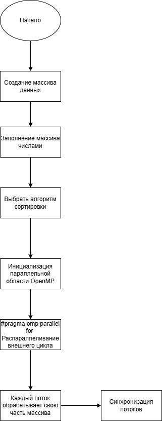

# Практическая работа №2  
## Параллельная реализация простых алгоритмов сортировки с использованием OpenMP

---

### Задание

#### 1. Последовательная реализация
Реализованы функции сортировки пузырьком, выбором и вставкой
без использования OpenMP.
<p align="center">
  
</p>
---

#### 2. Параллельная реализация с использованием OpenMP
Реализованы параллельные версии алгоритмов сортировки с использованием директив
OpenMP. Параллелизация выполнена преимущественно по внешним циклам.

Тестирование производительности проводилось на массивах размером:
- 1 000 элементов
- 10 000 элементов
- 100 000 элементов


<p align="center">
  
</p>
---

#### 3. Сравнение производительности
Для измерения времени выполнения последовательных и параллельных реализаций
использовалась библиотека `<chrono>`.  
На основе полученных результатов проведено сравнение производительности и
сформулированы выводы.

---
### Результаты компиляции
```bash
Array's size: 1000
Bubble Sort (seq): 3 ms
Bubble Sort (OMP): 52 ms
Selection Sort (seq): 0 ms
Selection Sort (OMP): 53 ms
Insertion Sort (seq): 0 ms
Insertion Sort (OMP): 0 ms

Array's size: 10000
Bubble Sort (seq): 307 ms
Bubble Sort (OMP): 546 ms
Selection Sort (seq): 96 ms
Selection Sort (OMP): 521 ms
Insertion Sort (seq): 67 ms
Insertion Sort (OMP): 66 ms
```

### Пример компиляции
```bash
g++ -fopenmp main.cpp -o main
./main.exe
```


### Контрольные вопросы

##### 1. В чём основные отличия сортировок пузырьком, выбором и вставкой?
Сортировка пузырьком постоянно меняет местами соседние элементы,
сортировка выбором ищет минимальный элемент и ставит его на место,
а сортировка вставкой по очереди вставляет элементы в уже отсортированную часть массива.


##### 2. Почему параллельная сортировка вставкой сложнее с OpenMP?
Потому что каждый шаг сортировки вставкой зависит от предыдущего,
и элементы нельзя обрабатывать независимо в разных потоках.
##### 3. Какие директивы OpenMP были использованы?
В основном использовалась директива 
```html
#pragma omp parallel for
```
для распараллеливания внешних циклов.

##### 4. Какие преимущества и недостатки параллельной сортировки на CPU?
Преимущество можно ускорить работу за счёт нескольких потоков.
Недостатки накладные расходы на потоки и слабая эффективность для простых сортировок


##### 5. Как можно измерить производительность программы в C++?
С помощью библиотеки "chrono", измеряя время выполнения участка кода.

##### 6. Как изменяется производительность при увеличении числа потоков?
Сначала может быть ускорение, но дальше рост замедляется
или даже появляется замедление из-за накладных расходов.

##### 7. Когда параллельная сортировка хуже последовательной?
При маленьких массивах, сильных зависимостях между шагами алгоритма
и больших затратах на синхронизацию потоков.